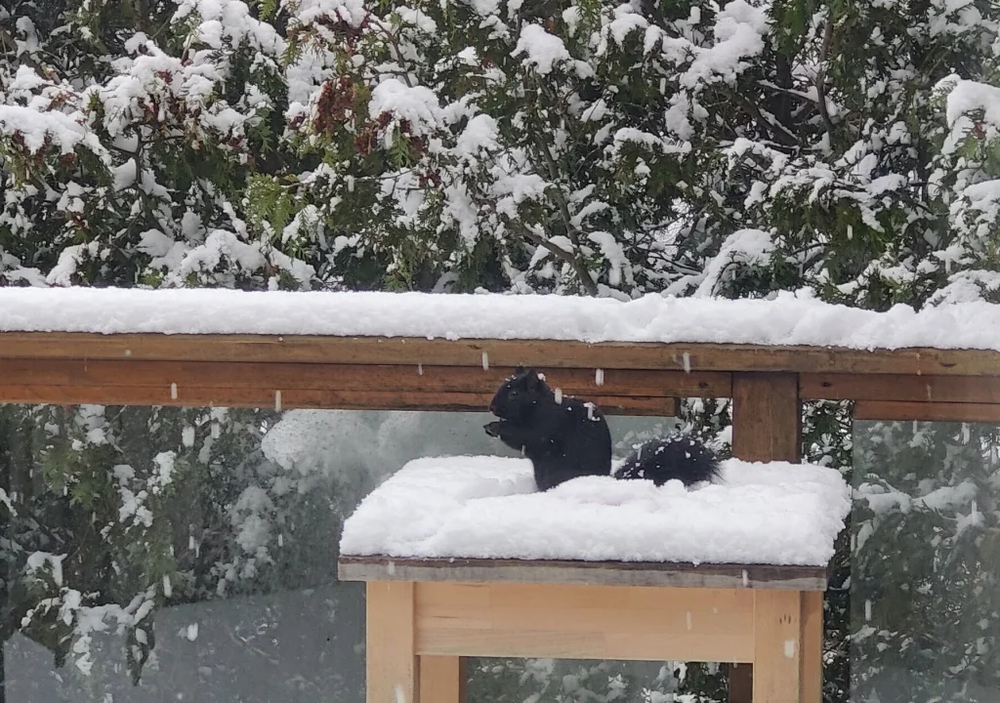
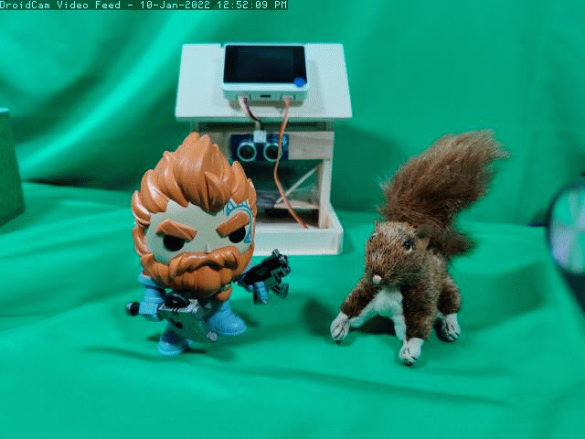
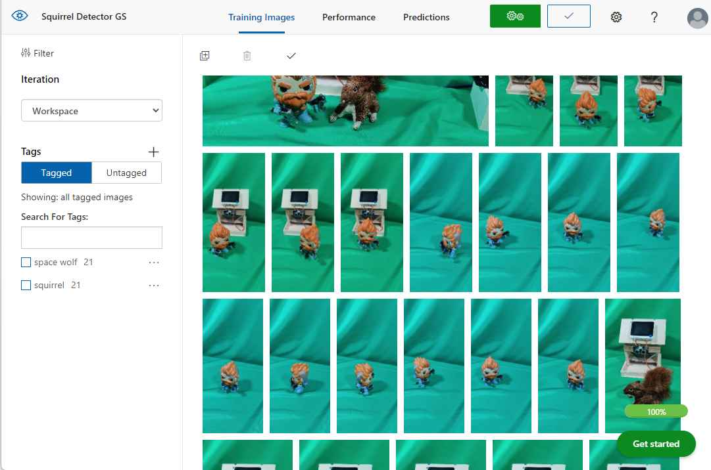
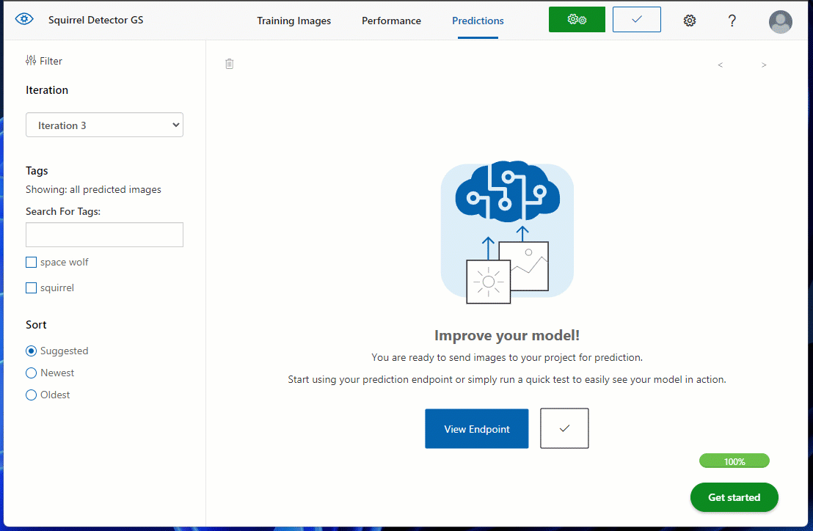
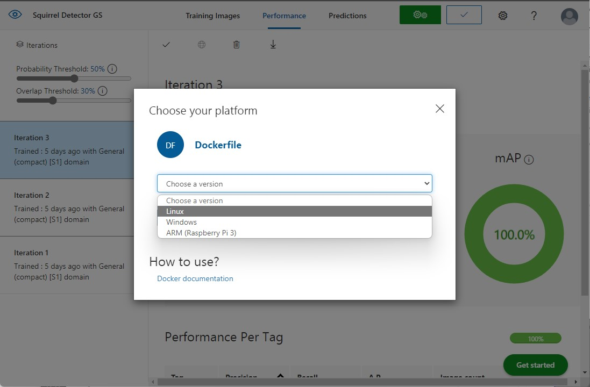
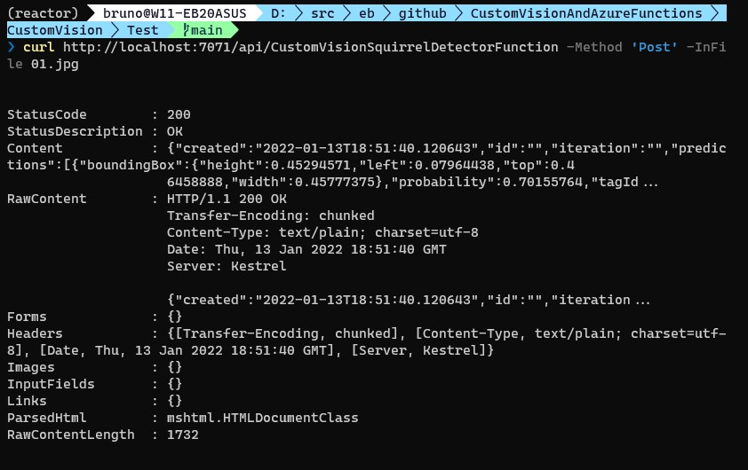
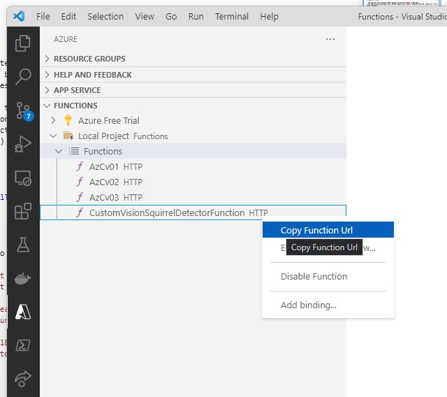

# Object recognition using Azure Custom Vision AI and Azure Functions

[](/LICENSE)
[](https://twitter.com/kartben)


*Ejemplo para la sesión de GitHub y Visual Studio Code.*

During the last couple of months, I’ve having fun with my new friends at home: 🐿️🐿️🐿️. These little ones, are extremelly funny, and they literally don’t care about the cold 🥶❄️☃️.

[](squirrell-on-the-snow.png)

So, I decided to help them and build an Automatic Feeder using Azure IoT, a Wio Terminal and maybe some more devices. You can check the Azure IoT project here [Azure IoT - Squirrel Feeder](https://aka.ms/AzureIoTSquirrelFeederGitHub).

Once the feeder was ready, I decided to add a new feature to the scenario, detecting when a squirrel 🐿️ is nearby the feeder. In this repository I'll share:

- How to create an object recognition model using [Azure Custom Vision](https://aka.ms/CustomVision-ci).
- How to export the model to a Docker image format.
- How to run the model in an Azure Function.

[](squirrell-on-the-snow.png)

## Custom Vision

[Azure Custom Vision](https://aka.ms/CustomVision-ci) is an image recognition service that lets you build, deploy, and improve your own image identifier models. An image identifier applies labels (which represent classifications or objects) to images, according to their detected visual characteristics. Unlike the Computer Vision service, Custom Vision allows you to specify your own labels and train custom models to detect them. 

The [quickstart](https://aka.ms/CustomVision-ci) section contains step-by-step instructions that let you make calls to the service and get results in a short period of time. 

You can use the images in the "[CustomVision/Train/](CustomVision/Train/)" directory in this repository to train your model.




Here is the model performing live recognition in action: 



## Exporting the model to a Docker image

Once the model was trained, you can export it to several formats. We will use a Linux Docker image format for the Azure Function. 



The exported model has several files. The following list shows the files that we use in our Azure Function:

- Dockerfile: the Dockerfile that will be used to build the image
- app/app.py: the Python code that runs the model
- app/labels.txt: The labels that the model recognizes
- app/model.pb: The model definition
- app/predict.py: the Python code that performs predictions on images

You can check the exported model in the "[CustomVision/DockerLinuxExported/](CustomVision/DockerLinuxExported/)" directory in this repository.

## Azure Function

Time to code! Let's create a new Azure Function Using [Visual Studio Code](https://code.visualstudio.com/) and the [Azure Functions for Visual Studio Code](https://marketplace.visualstudio.com/items?itemName=ms-azuretools.vscode-azurefunctions) extension. 


### Changes to `__ init __.py`
The following code is the final code for the `__ init __.py` file in the Azure Function.

A couple of notes:

- The function will receive a POST request with the file bytes in the body.
- In order to use the predict file, we must import the `predict` function from the `predict.py` file using ".predict"


```python
import logging
import azure.functions as func

# Imports for image procesing
import io
from PIL import Image
from flask import Flask, jsonify

# Imports for prediction
from .predict import initialize, predict_image

def main(req: func.HttpRequest) -> func.HttpResponse:
    logging.info('Python HTTP trigger function processed a request.')

    results = "{}"
    try:
        # get and load image from POST
        image_bytes = req.get_body()    
        image = Image.open(io.BytesIO(image_bytes))
        
        # Load and intialize the model and the app context
        app = Flask(__name__)
        initialize()

        with app.app_context():        
            # prefict image and process results in json string format
            results = predict_image(image)
            jsonresult = jsonify(results)
            jsonStr = jsonresult.get_data(as_text=True)
            results = jsonStr

    except Exception as e:
        logging.info(f'exception: {e}')
        pass 

    # return results
    logging.info('Image processed. Results: ' + results)
    return func.HttpResponse(results, status_code=200)
```

### Changes to `requirements.txt`

The `requirements.txt` file will define the necessary libraries for the Azure Function. We will use the following libraries:

```text
# DO NOT include azure-functions-worker in this file
# The Python Worker is managed by Azure Functions platform
# Manually managing azure-functions-worker may cause unexpected issues

azure-functions
requests
Pillow
numpy
flask
tensorflow
opencv-python
```

### Sample Code

You can view a sample function completed code in the "[AzureFunction/CustomVisionSquirrelDetectorFunction/](AzureFunction/CustomVisionSquirrelDetectorFunction/)" directory in this repository.


## Testing the sample

Once our code is complete we can test the sample in local mode or in Azure Functions, after we deploy the Function. In both scenarios we can use any tool or language that can perform HTTP POST requests to the Azure Function to test our function.

### Test using Curl

Curl is a command line tool that allows you to send HTTP requests to a server. It is a very simple tool that can be used to send HTTP requests to a server. We can test the local function using curl with the following command:

```bash
❯ curl http://localhost:7071/api/CustomVisionSquirrelDetectorFunction -Method 'Post' -InFile 01.jpg
```



### Test using Postman

**Postman** is a great tool to test our function. You can use it to test the function in local mode and also to test the function once it has been deployed to Azure Functions. You can download Postman [here](https://www.postman.com/downloads/).

In order to test our function we need to know the function url. In Visual Studio Code, we can get the url by clicking on the Functions section in the Azure Extension. Then we can right click on the function and select "Copy Function URL".



Now we can go to Postman and create a new POST request using our function url. We can also add the image we want to test. Here is a live demo, with the function running locally, in Debug mode in Visual Studio Code:


We are now ready to test our function in Azure Functions. To do so we need to deploy the function to Azure Functions. And use the new Azure Function url with the same test steps. 

## Additional Resources

You can check a session recording about this topic in English and Spanish.

- Eng - [Azure Custom Vision running on Azure functions](https://aka.ms/ServerlesssinJan1.11)
- Spa - [Coming soon](https://aka.ms/ServerlesssinJan1.11)

These links will help to understand specific implementations of the sample code:

- [Microsoft Docs - What is Custom Vision?](https://aka.ms/CustomVision-ci)
- [Microsoft Docs - Test and retrain a model with Custom Vision Service](https://aka.ms/CustomVisionService-ci)
- [Microsoft Learn - Create serverless applications](https://aka.ms/CreateServerlessApps-ci)
- [AZ-204: Implement Azure Functions](https://aka.ms/AzureFunctions-ci)

In my personal blog "[ElBruno.com](https://elbruno.com)", I wrote about several scenarios on how to work and code with [Custom Vision](https://elbruno.com/tag/custom-vision/). 

## Author

👤 **Bruno Capuano**

* Website: https://elbruno.com
* Twitter: [@elbruno](https://twitter.com/elbruno)
* Github: [@elbruno](https://github.com/elbruno)
* LinkedIn: [@elbruno](https://linkedin.com/in/elbruno)

## 🤝 Contributing

Contributions, issues and feature requests are welcome!

Feel free to check [issues page](https://github.com/elbruno/CustomVisionAndAzureFunctions/issues).

## Show your support

Give a ⭐️ if this project helped you!


## 📝 License

Copyright &copy; 2021 [Bruno Capuano](https://github.com/elbruno).

This project is [MIT](/LICENSE) licensed.

***
